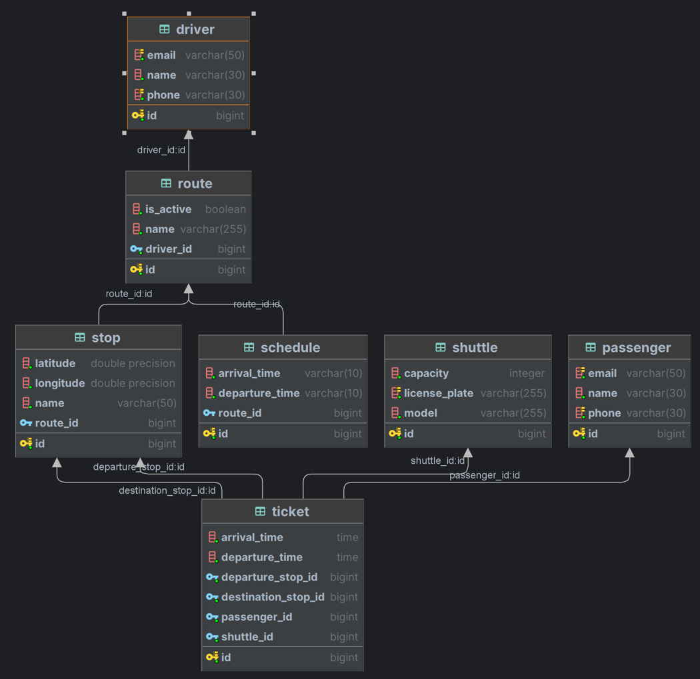

# Shuttle REST API

## Описание предметной области

Система для компании-перевозчиков, осуществляющих регулярные рейсы, и их клиентов.
- Клиент может:
  - просматривать/редактировать информацию о себе
  - просматривать информацию о доступных поездках 
  - бронировать поездки
  - просматривать список своих поездок (в том числе историю)
- Компания может:
  - просматривать/редактировать информацию о себе 
  - регистрировать автомобили, поездки, расписания, водителей
- Водитель может:
  - просматривать информацию о своих маршрутах
  - отмечать явку/неявку клиента
  
### Схема базы данных 

## Требования

Перед началом работы убедитесь, что у вас установлены следующие компоненты:

- Java Development Kit (JDK) версии 17
- Docker (для запуска РСУБД PostgreSQL)

## Установка и запуск

1. Склонируйте репозиторий проекта с помощью команды:

   ```bash
   git clone https://github.com/mikolaaaaaaa/ShuttleREST.git
   ```

2. Перейдите в директорию проекта:

   ```bash
   cd ShuttleREST
   ```

3. Установите зависимости проекта с помощью Maven Wrapper (mvnw):

   ```bash
   ./mvnw install
   ```

4. Запустите Docker Compose с помощью команды:

   ```bash
   docker-compose up
   ```

5. При необходимости отредактируйте файлы конфигурации проекта в `src/main/resources/application.yml`

6. Запустите приложение с помощью Maven Wrapper (mvnw):

   ```bash
   ./mvnw spring-boot:run
   ```

Swagger UI доступен по URL - `http://localhost:8080/api/swagger-ui/index.html`
